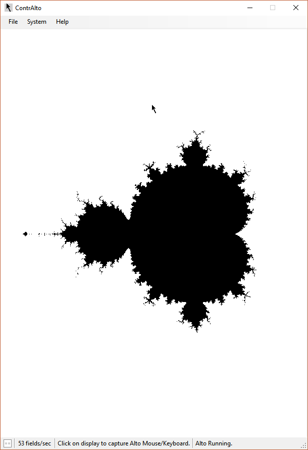

# Mandelbrot for the Xerox Alto

## To build and run:
* Copy *mandel.bcpl* and *pressml.asm* to the Alto (e.g. with FTP)
* `asm pressml.asm`
* `bcpl mandel.bcpl`
* `bldr/d/l/v mandel pressml`
* `mandel`

This program takes about an hour to run, since the Xerox Alto is not a fast computer.

You can run this using thie [Contralto](https://github.com/livingcomputermuseum/ContrAlto) emulator if you don't have an Alto available.

The Alto inconveniently uses \\r instead of \\n as a line separator, so I've included mandel.txt as a more readable version of mandel.bcpl.

## How it works

The Xerox Alto uses 16-bit integers, and no floating point.
Since the Mandelbrot computation uses real numbers, I represent them in fixed point: 4 bits to the left of the decimal point and 12 bits to the right. (Fixed-point arithmetic is a common trick for fast Mandelbrot calculation.)

To multiply two 16-bit numbers, I use the double precision MulFull function (written in Nova assembler) in [PressML.asm](http://xeroxalto.computerhistory.org/_cd8_/press/presssources.dm!2_/.PressML.asm.html), part of the Computer History Museum's archived Alto software.
The result must be right-shifted 12 bits to restore the fixed-point offset.

Setting the pixels is a bit tricky. A block of memory is allocated for the display and then the appropriate bit in the appropriate word is set to get a black pixel. The gory details are in chapter 4 of the [Xerox Alto Hardware Manual](http://bitsavers.trailing-edge.com/pdf/xerox/alto/Alto_Hardware_Manual_Aug76.pdf).

## Some notes on BCPL

The code is written in BCPL, the main langauge used on the Alto. BCPL is a precursor to C and many features of C are clearly visible in BCPL.

BCPL has some trivial syntax differences compared to C. Keeping the following in mind, you should be able to understand the BCPL code:
* Blocks indicated with [ and ] instead of { and }.
* Indexing with a!1 instead of a[0].
* And, Or, and Shift bit operations are &, %, and lshift/rshift.
* Variable definitions with *let*.
* Headers included with *get*.
* Comparison with *eq* instead of *==*.
* Arrays defined with *vec*.

More information on BCPL is in the [BCPL Reference Manual](http://bitsavers.org/pdf/xerox/alto/bcpl/BCPL_Reference_Manual_Sep75.pdf).

## Screenshot

